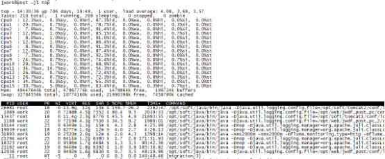
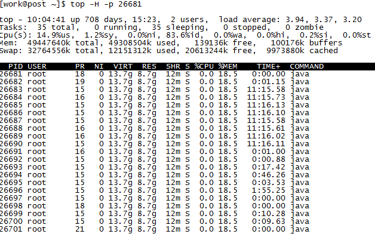
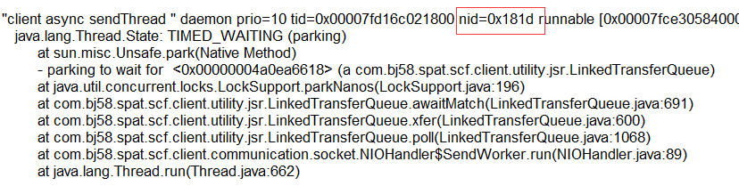

操作系统：Centos
运行环境：Java HotSpot(TM) 64-Bit Server VM (build 17.1-b03, mixed mode)

1. 确定占cpu高的进程 命令：top  注：top默认按cpu占比排序，按快捷键1查看每个逻辑cpu的情况,如图：

2. 确定占CPU高的线程 命令：top -H -p pid
如图：

3. 用jstack命令打印出堆栈信息，命令：sudo /opt/soft/java/bin/jstack -l pid > /tmp/js.log
4. 根据第二步找出的占用cpu100%的线程pid，转换为16进制找到对应的nid查看对应的堆栈信息
如图：

下面是自动化脚本：分两步
1.top出进程ip
2.sh topThread.sh pid topN

